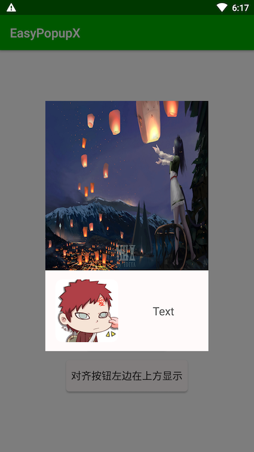
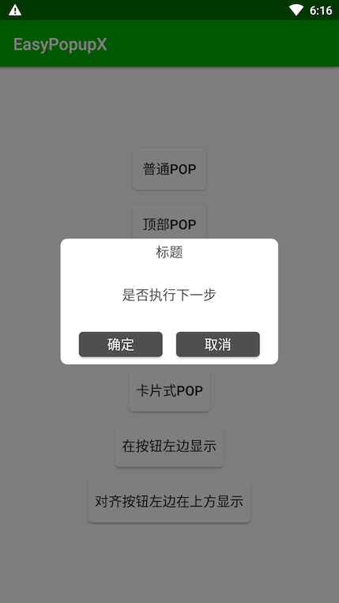

[](https://jitpack.io/#dengzhenli/EasyPopup)

---
# 关于EasyPopup

EasyPopup是一个可以让你在项目里面轻松使用PopupWindow的工具。
你只需按正常的使用习惯即可，其他的事情都交给EasyPopup

你可以通过EasyPopup轻松实现例如以下的页面
<figure class="third">    
    
    
    
</figure>


---
# 快速接入


## 添加依赖
根项目build.gradle添加jitpack
```
allprojects {
    repositories {
        .....
        maven { url "https://jitpack.io" }
    }
}
```
添加依赖
```
dependencies {
     implementation 'com.github.dengzhenli:EasyPopup:1.0'
}
```
## 定制你的PopupWindow
```kotlin
class TestPop(activity: Activity) : EasyPop(activity) {
    // 这里进行初始化视图操作
    override fun initView(view: View?) { pop_example_text.text = "我是普通弹出窗" }
    // 这里进行初始化数据操作
    override fun initData() {}
    // 这里输入你自己编写的布局文件
    override fun getLayoutId(): Int { return R.layout.pop_test }
    // 点击外部弹窗是否消失
    override fun outClickable(): Boolean { return true }
}
```

你也可以使用java接入，为节省篇幅，后面的演示只用kotlin，java的使用可参考demo
```java
public class TestPop extends EasyPop {
    public TestPop(Activity activity) {  super(activity); }
    @Override
    public void initView(View view) {
        TextView textView = findViewById(R.id.pop_example_text);
        textView.setText("我是普通弹出窗");
    }
    @Override
    public void initData() {}
    @Override
    public int getLayoutId() { return R.layout.pop_test;  }

    @Override
    public boolean outClickable() { return true;  }
}

```
## 调用

### 建议：activity实现 LifecycleOwner 接口，并在调用easypop之前调用register方法  
此方法会进行生命周期注册等步骤。若没有进行此步骤，EasyPop需要生命周期时候需要手动调用
```kotlin
class MainActivity : AppCompatActivity(), LifecycleOwner {

    override fun onCreate(savedInstanceState: Bundle?) {
        super.onCreate(savedInstanceState)
        setContentView(R.layout.activity_main)
        EasyPopManager.register(this, this)
    }
}

```
### 必须：保证onDestory被正常调用  

请确保你重写onDestroy时候没有覆盖EasyPop的实现
```kotlin
override fun onDestroy() {
    super.onDestroy()
}
```
如果你没有接入第一点建议的操作，则需要在Activity的onDestory方法调用EasyPop的onDestory

### 建议：在onWindowFocusChanged方法调用EasyPopManager.onWindowFocusChanged  
```kotlin
    override fun onWindowFocusChanged(hasFocus: Boolean) {
        super.onWindowFocusChanged(hasFocus)
        EasyPopManager.onWindowFocusChanged(this, hasFocus)
    }
```
### 必须：在需要调用时候创建EasyPop  
```kotlin
    fun normalPop(view: View) {
        TestPop(this).show()
    }
```

### 不重要：你也可以直接声明匿名内部类
```kotlin
    fun normalPop(view: View) {
        object : EasyPop(this@MainActivity) {
            override fun outClickable(): Boolean {
                return true
            }

            override fun initData() {}
            override fun initView(view: View?) {
                pop_example_text.text = "我是普通弹出窗"
            }

            override fun getLayoutId(): Int {
                return R.layout.pop_test
            }

        }.show()
    }
```


---
# 属性


## EasyPop属性

调用示例
```kotlin
val easyPop = TestPop(this);
easyPop.gravity = Gravity.RIGHT
easyPop.show()
```

属性名|属性描述|单位
---|---|---
popupWidth|弹窗的宽度|px
popupHeight|弹窗的高度|px
viewWidth| 弹窗内view的宽度|px
viewHeight| 弹窗内view的高度|px
gravity| 弹窗方向，使用android.view.Gravity的值|int
marginWidth| 弹窗方向基础上距离水平距离|px
marginHeight| 弹窗方向基础上距离垂直距离|px
bgAlpha| 弹窗背景透明度 0-1 |float
isShow| 弹窗是否显示状态|boolean


## XML属性

用于自己定制layout的配置能透传到easypop，例如如下的android:layout_height，不使用easypop的话是不会生效的，
但我觉得这种样式与布局的配置就应该在xml里面设置。easypop已对基本的配置都进行兼容，你只要按照正常的习惯配置即可。
```xml
<?xml version="1.0" encoding="utf-8"?>

<LinearLayout
    xmlns:android="http://schemas.android.com/apk/res/android"
    android:layout_width="match_parent"
    android:layout_height="400dp" 
    >
    <include layout="@layout/pop_example"/>

</LinearLayout>
```
这里的设置本质上是修改easypop的属性，若被影响属性在代码里面手动设置过，则使用手动设置的属性  

属性名|影响属性|备注
---|---|---
"layout_width" |viewWidth popupWidth |
"layout_height" | viewHeight popupHeight |
"layout_gravity"| gravity |
"layout_marginLeft"|   marginWidth |
"layout_marginRight"|   marginWidth |优先于layout_marginLeft
"layout_marginHorizontal"|   marginWidth |优先于layout_marginRight
"layout_marginStart"|  marginWidth |优先于layout_marginHorizontal
"layout_marginEnd"|  marginWidth |优先于layout_marginEnd
"layout_marginBottom"| marginHeigh|
"layout_marginTop"|   marginHeight 优先于layout_marginBottom
"layout_marginVertical"| marginHeight |优先于layout_marginTop
"layout_margin" |  marginWidth     marginHeight |优先于layout_marginVertical，layout_marginHorizontal
  
## 可用方法

方法|描叙
---|---
getLayoutId(): Int|抽象方法，必须实现，设置布局ID
initView(view: View?)|抽象方法，必须实现，编写页面逻辑
initData(）|抽象方法，必须实现，初始化数据
outClickable(): Boolean|点击外部弹窗是否消失    
show(): EasyPop|显示弹窗
finish()|关闭弹窗
dismiss()|隐藏弹窗 
setWidth(width: Int) |设置弹窗宽度，影响viewWidth popupWidth
setHeight(height: Int) |设置弹窗高度 viewHeight popupHeight
onWindowFocusChanged(hasWindowFocus: Boolean)|activity回调方法

### 回调方法
方法|描叙
 ---|---
onReShowPop()|  pop重新加载时调用
onCreatePop() | pop初次加载时调用
onPopDismiss()| pop隐藏时调用
 
 
### 生命周期
easypop通过lifecycle监听Activity的生命周期，因为弹窗调用时候基本activity已经加载完毕，故不监听onCreate和onStart方法  

方法|描叙
---|---
 onDestroy()|Activity生命周期
 onResume()|Activity生命周期
 onPause()|Activity生命周期
 onStop()|Activity生命周期
 

---
# 组件


## 卡片式弹出窗

### CardPopup 卡片式弹出窗
使用：创建一个继承于CardPopup的弹窗，其中getContentLayoutId指定你的布局
```kotlin
class CardTestPop : CardPopup {
    constructor(activity: Activity) : super(activity) {}

    override fun outClickable(): Boolean { return true   }

    override fun getContentLayoutId(): Int {
        return R.layout.card_pop_test
    }
}
```

```kotlin
fun cardPop(view: View) {
    CardTestPop(this).show()
}
```
```xml
<LinearLayout xmlns:android="http://schemas.android.com/apk/res/android"
    android:layout_width="match_parent"
    android:layout_height="wrap_content">

    <include layout="@layout/pop_example"/>
</LinearLayout>

```


CardPopup有两个构造方法  
* constructor(activity: Activity, gravity: Int, width: Int, height: Int)  

        gravity：弹窗方向   
        
        width：弹窗宽度   
        
        height：弹窗高度   

* constructor(activity: Activity)  

        默认gravity为Gravity.BOTTOM   
        
        默认width为MATCH_PARENT   
        
        默认height为WRAP_CONTENT   


## dialog

### DialogPop 通用dialog
示例：
```kotlin
class DialogTest : DialogPop {
    constructor(activity: Activity) : super(activity) {}

    constructor(activity: Activity, gravity: Int, width: Int, height: Int) : super(
        activity,
        gravity,
        width,
        height
    ) {
    }

    override fun getContentLayoutId(): Int {
        return R.layout.pop_test
    }

    override fun outClickable(): Boolean {
        return true
    }

    // 是否使用DialogPop自带背景，选择否，则使用透明背景
    override fun useBackGround(): Boolean {
        return false
    }

}
```

```kotlin
        DialogTest(this, Gravity.CENTER,
            ScreenUtil.dip2px(this,300F),
            ScreenUtil.dip2px(this,400F))
            .show()
```


DialogPop有两个构造方法  
* constructor(activity: Activity, gravity: Int, width: Int, height: Int)  

        gravity：弹窗方向   
        
        width：弹窗宽度   
        
        height：弹窗高度   

* constructor(activity: Activity)  

        默认gravity为Gravity.BOTTOM   
        
        默认width为MATCH_PARENT   
        
        默认height为WRAP_CONTENT   

### AlertDialogPop 标准dialog
AlertDialogPop的用法可参考安卓AlertDialog  
```kotlin

    fun alertDialogPop(view: View) {
        AlertDialogPop.Builder(this)
            .setTitle("标题")
            .setMessage("是否进行下一步操作")
            .setMeasureButton(true, null, View.OnClickListener { finish() })
            .setCancelButton(true, null, null)
            .show()
    }
```

## 其他组件
* BottomPop 底部弹出窗
* LeftPop 左侧弹出窗
* RightPop 右侧弹出窗
* TopPop 顶部弹出窗