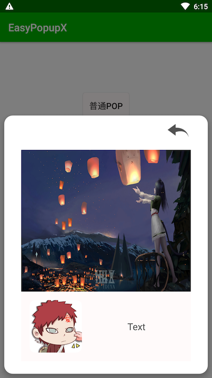

[](https://jitpack.io/#dengzhenli/EasyPopupX)

---
# 关于EasyPopupX

EasyPopupX是一个可以让你在项目里面轻松使用PopupWindow的工具。
你只需按正常的使用习惯即可，其他的事情都交给EasyPopupX

目前EasyPopupX能带给你的明显变化
* 只需极少的代码
* PopupWindow相关的安全性，兼容性，内存优化都交给EasyPopupX去考虑
* 可以在布局文件里面配置PopupWindow位置了
* 可以在PopupWindow里面直接使用findViewById
* 其他更多属性


[pop_example](img/pop_example.gif)

---
# 更新记录
## 1.0.3
* 删除过多的抽象方法
* 优化接口
* 删除意义不大的Lifecycle

---
# 快速接入

## 添加依赖
根项目build.gradle添加jitpack
```
allprojects {
    repositories {
        .....
        maven { url "https://jitpack.io" }
    }
}
```
添加依赖
```
dependencies {
     implementation 'com.github.dengzhenli:EasyPopupX:1.0.3'
}
```

如果项目没有使用kotlin导致报kotlin错误，需添加依赖  
```
dependencies {
    // XXX为kt版本号，例如：1.4.21
    implementation "org.jetbrains.kotlin:kotlin-stdlib:XXX"
}
```

## 使用

### 在需要调用时候创建EasyPop的实现类
```kotlin
    fun normalPop(view: View) {
         object : EasyPop(this@MainActivity) {   
               // 你自己的布局文件ID
               override fun getLayoutId(): Int {
                   return R.layout.pop_test
               }    
               // 布局创建完成，在这里写你的逻辑代码 
               override fun onPopCreated(view: View?) {
                   pop_example_text.text = "我是普通弹出窗"
               }
           }.show()
    }
```
这里为了方便演示使用匿名内部类，实际开发建议单独创建一个类继承EasyPop。  

你也可以使用java接入，为节省篇幅，演示只用kotlin，java的使用可参考demo。  

***pop_test.xml***
```XML
<?xml version="1.0" encoding="utf-8"?>

<androidx.constraintlayout.widget.ConstraintLayout xmlns:android="http://schemas.android.com/apk/res/android"
    xmlns:app="http://schemas.android.com/apk/res-auto"
    android:layout_width="match_parent"
    android:layout_height="400dp"
    android:layout_marginTop="20dp"
    android:layout_gravity="top">

    <include layout="@layout/pop_example"/>

</androidx.constraintlayout.widget.ConstraintLayout>
```


### 在onWindowFocusChanged方法调用EasyPopManager.onWindowFocusChanged  
这一步不是必须的，只是兼容一些不显示的情况
```kotlin
    override fun onWindowFocusChanged(hasFocus: Boolean) {
        super.onWindowFocusChanged(hasFocus)
        EasyPopManager.onWindowFocusChanged(this, hasFocus)
    }
```


---
# 方法
## 可继承方法
```
    /**
     * 布局文件
     */
    abstract fun getLayoutId(): Int

    /**
     * PopupWindow初始化时候回调
     */
    open fun onPopInit() {}

    /**
     * PopupWindow创建成功时候回调
     */
    abstract fun onPopCreated(view: View?)

    /**
     * PopupWindow重新加载时候回调
     */
    open fun onPopReShow() {}

    /**
     * PopupWindow关闭时候回调
     */
    open fun onPopDismiss() {}
```
## PopupWindow方法
### 显示
* `fun show(): EasyPop`
```kotlin
    fun onButtonClick(view: View) {
        TestPop(this)
        .show()
    }
```
### 关闭
* `fun finish(): EasyPop`
```kotlin
   pop.finish()
```
### 隐藏
* `fun dismiss(): EasyPop`
```kotlin
   pop.dismiss()
```


## PopupWindow设置
### 设置宽度
* `fun setWidth(width: Int): EasyPop`
```kotlin
    fun onButtonClick(view: View) {
        TestPop(this)
        .setWidth(500)
        .show()
    }
```
### 设置高度
* `fun setHeight(height: Int): EasyPop`
```kotlin
    fun onButtonClick(view: View) {
        TestPop(this)
        .setHeight(500)
        .show()
    }
```

### 背景设置
* `fun setBackGround(value: Drawable): EasyPop`
```kotlin
    fun onButtonClick(view: View) {
        TestPop(this)
        .setBackGround(ColorDrawable(Color.TRANSPARENT))
        .show()
    }
```

### 设置透明度
* `fun setBgAlpha(alpha: Float): EasyPop`

alpha: 打开弹窗后背景view的透明度 范围0-1。0为完全不可见，1为完全可见
```kotlin
    fun onButtonClick(view: View) {
        TestPop(this)
        .setBgAlpha(0.5f)
        .show()
    }
```
### 是否可通过点击外部关闭弹窗

默认true
* `fun outClickable(clickable: Boolean): EasyPop`
```kotlin
    fun onButtonClick(view: View) {
        TestPop(this)
        .outClickable(false)
        .show()
    }
```

### 设置位置

相对于根布局的位置，与View 的 gravity 用法一样，EasyPopup默认是相对View展示的，默认居中
* `fun setGravity(value: Int): EasyPop`
```kotlin
    fun onButtonClick(view: View) {
        TestPop(this)
        .setGravity(Gravity.TOP)
        .show()
    }
```

### 设置相对view展示
EasyPopup默认是相对View展示的，如果你想相对某个view展示，则可设置showOnView方法（setGravity属性将无效）
* `fun showOnView(showAtView: View): EasyPop`
只设置相对view，默认在该控件下方相对控件居中位置

* `fun showOnView(showAtView: View,vararg gravity: EasyPopGravity): EasyPop`
设置相对view以及位置，EasyPopGravity可设置多组
```kotlin
    fun onButtonClick(view: View) {
        TestPop(this)
        .showOnView(viewAboveLeft, EasyPopGravity.ALIGN_LEFT, EasyPopGravity.TO_ABOVE)
        .show()
    }
```

EasyPopGravity有以下设置：
* CENTER 居中
* TO_ABOVE 控件上方
* TO_BELOW 控件下方
* TO_LEFT 控件左边
* TO_RIGHT 控件右边
* ALIGN_TOP 对齐控件顶方
* ALIGN_BOTTOM 对齐控件底方
* ALIGN_LEFT 对齐控件左边
* ALIGN_RIGHT 对齐控件右边

### 设置水平偏移
* `fun setMarginWidth(value: Int): EasyPop`
### 设置垂直偏移
* `fun setMarginHeight(value: Int): EasyPop`

# 属性

## XML属性

用于自己定制layout的配置能透传到easypop，例如如下的android:layout_height，不使用easypop的话是不会生效的，
但我觉得这种样式与布局的配置就应该在xml里面设置。easypop已对基本的配置都进行兼容，你只要按照正常的习惯配置即可。
```xml
<?xml version="1.0" encoding="utf-8"?>

<LinearLayout
    xmlns:android="http://schemas.android.com/apk/res/android"
    android:layout_width="match_parent"
    android:layout_height="400dp" 
    >
    <include layout="@layout/pop_example"/>

</LinearLayout>
```
这里的设置本质上是修改easypop的属性，若被影响属性在代码里面手动设置过，则使用手动设置的属性  

属性名|对应方法|备注
---|---|---
"layout_width" |setWidth |
"layout_height" | setHeight |
"layout_gravity"| setGravity |
"layout_marginLeft"|   setMarginWidth |
"layout_marginRight"|   setMarginWidth |优先于layout_marginLeft
"layout_marginHorizontal"|   setMarginWidth |优先于layout_marginRight
"layout_marginStart"|  setMarginWidth |优先于layout_marginHorizontal
"layout_marginEnd"|  setMarginWidth |优先于layout_marginEnd
"layout_marginBottom"| setMarginHeight|
"layout_marginTop"|   setMarginHeight 优先于layout_marginBottom
"layout_marginVertical"| setMarginHeight |优先于layout_marginTop
"layout_margin" |  setMarginWidth     setMarginHeight |优先于layout_marginVertical，layout_marginHorizontal
  

---
# 组件

## 卡片式弹出窗

### CardPopup 卡片式弹出窗
使用：创建一个继承于CardPopup的弹窗，其中getContentLayoutId指定你的布局
```kotlin
class CardTestPop : CardPopup {
    constructor(activity: Activity) : super(activity) {}

    override fun getContentLayoutId(): Int {
        return R.layout.card_pop_test
    }
}
```

```kotlin
fun cardPop(view: View) {
    CardTestPop(this).show()
}
```
```xml
<LinearLayout xmlns:android="http://schemas.android.com/apk/res/android"
    android:layout_width="match_parent"
    android:layout_height="wrap_content">

    <include layout="@layout/pop_example"/>
</LinearLayout>

```


CardPopup有两个构造方法  
* constructor(activity: Activity, gravity: Int, width: Int, height: Int)  

        gravity：弹窗方向   
        
        width：弹窗宽度   
        
        height：弹窗高度   

* constructor(activity: Activity)  

        默认gravity为Gravity.BOTTOM   
        
        默认width为MATCH_PARENT   
        
        默认height为WRAP_CONTENT   


## dialog

### DialogPop 通用dialog
示例：
```kotlin
class DialogTest : DialogPop {
    constructor(activity: Activity) : super(activity) {}

    constructor(activity: Activity, gravity: Int, width: Int, height: Int) : super(
        activity,
        gravity,
        width,
        height
    ) {
    }

    override fun getContentLayoutId(): Int {
        return R.layout.pop_test
    }


    // 是否使用DialogPop自带背景，选择否，则使用透明背景
    override fun useBackGround(): Boolean {
        return false
    }

}
```

```kotlin
        DialogTest(this, Gravity.CENTER,
            ScreenUtil.dip2px(this,300F),
            ScreenUtil.dip2px(this,400F))
            .show()
```


DialogPop有两个构造方法  
* constructor(activity: Activity, gravity: Int, width: Int, height: Int)  

        gravity：弹窗方向   
        
        width：弹窗宽度   
        
        height：弹窗高度   

* constructor(activity: Activity)  

        默认gravity为Gravity.BOTTOM   
        
        默认width为MATCH_PARENT   
        
        默认height为WRAP_CONTENT   

### AlertDialogPop 标准dialog
AlertDialogPop的用法可参考安卓AlertDialog  
```kotlin

    fun alertDialogPop(view: View) {
        AlertDialogPop.Builder(this)
            .setTitle("标题")
            .setMessage("是否进行下一步操作")
            .setMeasureButton(true, null, View.OnClickListener { finish() })
            .setCancelButton(true, null, null)
            .show()
    }
```

## 其他组件
* BottomPop 底部弹出窗
* LeftPop 左侧弹出窗
* RightPop 右侧弹出窗
* TopPop 顶部弹出窗

# 常见问题
## 提示创建失败，请等待页面渲染完毕怎么办？
参考[在onWindowFocusChanged方法调用EasyPopManager.onWindowFocusChanged](#在onwindowfocuschanged方法调用easypopmanageronwindowfocuschanged) 

# License

EasyPopupX is Apache 2 licensed, as found in the LICENSE file.
